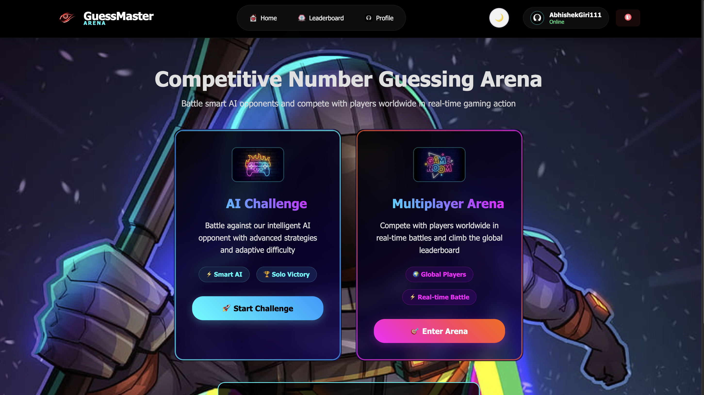
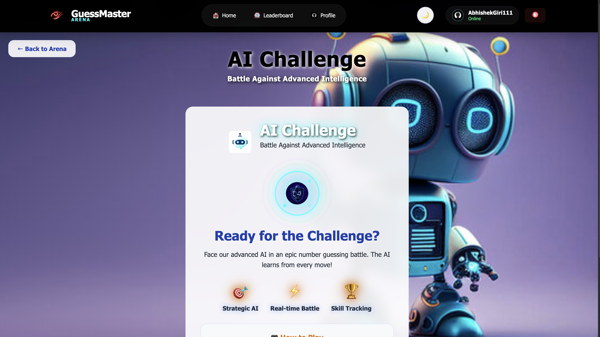
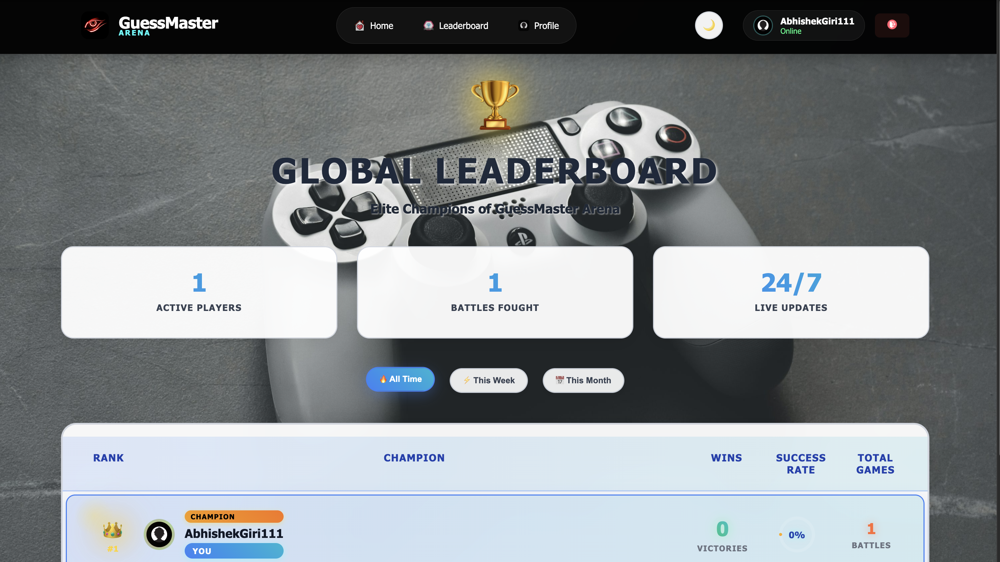
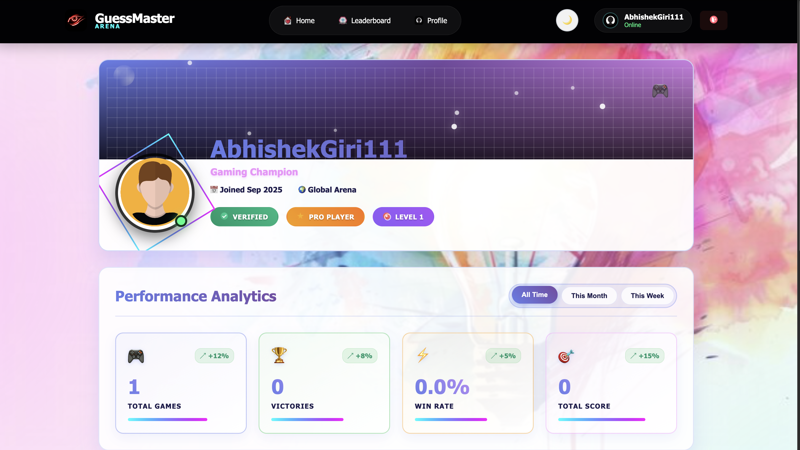

<h1 align="center">🎮 GuessMaster Arena — AI-Powered Number Guessing Platform</h1>

<p align="center">
  🚀 A cutting-edge real-time multiplayer gaming platform featuring intelligent AI opponents, competitive gameplay, and modern web technologies for <b>number guessing battles</b> and strategic gaming experiences.
</p>

<p align="center">
  
  
  
  
  
  
</p>
<br>

---

## 📖 Problem Statement
Traditional number guessing games lack competitive elements, real-time multiplayer capabilities, and intelligent AI opponents. Players need engaging, strategic gameplay with modern features like leaderboards, statistics tracking, and social interaction.

<br>

---

## 💡 Our Solution
GuessMaster Arena is a full-stack gaming platform built to:

- 🎯 Provide strategic number guessing gameplay with AI opponents
- 🏆 Enable real-time multiplayer battles with up to 4 players
- 🤖 Feature adaptive AI that learns from player behavior
- 📊 Deliver comprehensive statistics and leaderboard systems
- 🎨 Offer modern UI with dual theme support and animations
<br>

---  

## 🚀 Features

✅  **AI Challenge Mode** with adaptive intelligent opponents  
✅  **Real-time Multiplayer Arena** supporting up to 4 players  
✅  **Custom Room System** with unique room codes  
✅  **Live Statistics Tracking** and performance analytics  
✅  **Global Leaderboards** with competitive rankings  
✅  **Dual Theme Support** (Dark/Light) with animations  
✅  **JWT Authentication** with Google OAuth integration  
✅  **Responsive Design** with mobile-first approach

<br>

---  

## 🛠️ Tech Stack

<div align="center">

<table>
<thead>
<tr>
<th>🖥️ Technology</th>
<th>⚙️ Description</th>
</tr>
</thead>
<tbody>
<tr>
<td></td>
<td>Modern frontend with hooks and context API</td>
</tr>
<tr>
<td></td>
<td>High-performance JavaScript backend</td>
</tr>
<tr>
<td></td>
<td>Web application framework for APIs</td>
</tr>
<tr>
<td></td>
<td>NoSQL database for user and game data</td>
</tr>
<tr>
<td></td>
<td>Real-time bidirectional communication</td>
</tr>
<tr>
<td></td>
<td>Secure authentication and authorization</td>
</tr>
<tr>
<td></td>
<td>Advanced styling with animations</td>
</tr>
</tbody>
</table>

</div>

<br>

---

## 📁 Project Directory Structure

```
GuessMasterArena/
├── 📂 frontend/                    # 🎨 React frontend application
│   ├── 📂 public/
│   │   └── 📄 index.html          # 🌐 Main HTML template
│   ├── 📂 src/
│   │   ├── 📂 components/          # 🧩 Reusable UI components
│   │   │   ├── 📄 AuthForm.jsx     # 🔐 Authentication form
│   │   │   ├── 📄 ChatBox.jsx      # 💬 Chat functionality
│   │   │   ├── 📄 Footer.jsx       # 🔻 Footer with links
│   │   │   ├── 📄 ForgotPassword.jsx # 🔑 Password recovery
│   │   │   ├── 📄 GameRoom.jsx     # 🎮 Multiplayer room
│   │   │   ├── 📄 GoogleLogin.jsx  # 🔐 Google OAuth
│   │   │   ├── 📄 Loading.jsx      # ⏳ Loading screen
│   │   │   └── 📄 Navigation.jsx   # 🔝 Navigation header
│   │   ├── 📂 config/              # ⚙️ Configuration files
│   │   │   └── 📄 firebase.js      # 🔥 Firebase config
│   │   ├── 📂 context/             # 🔄 State management
│   │   │   ├── 📄 Auth.js          # 🔐 Authentication
│   │   │   ├── 📄 Game.js          # 🎮 Game state
│   │   │   └── 📄 Theme.js         # 🎨 Theme management
│   │   ├── 📂 pages/               # 📄 Main application pages
│   │   │   ├── 📄 Dashboard.jsx    # 📊 User dashboard
│   │   │   ├── 📄 GameGuide.jsx    # 📖 Game instructions
│   │   │   ├── 📄 Home.jsx         # 🏠 Landing page
│   │   │   ├── 📄 Leaderboard.jsx  # 🏆 Global rankings
│   │   │   ├── 📄 Login.jsx        # 🔐 Login page
│   │   │   ├── 📄 Multiplayer.jsx  # 👥 Multiplayer arena
│   │   │   ├── 📄 Profile.jsx      # 👤 User profile
│   │   │   ├── 📄 Register.jsx     # 📝 Registration page
│   │   │   ├── 📄 SinglePlayer.jsx # 🤖 AI Challenge mode
│   │   │   └── 📄 Support.jsx      # 🛠️ Help center
│   │   ├── 📂 services/            # 🌐 API services
│   │   │   ├── 📄 auth.js          # 🔐 Auth services
│   │   │   └── 📄 game.js          # 🎮 Game services
│   │   ├── 📂 styles/              # 🎨 CSS styling
│   │   │   ├── 📄 guide-support.css # 📖 Guide & support styles
│   │   │   └── 📄 main.css         # 🎨 Main stylesheet
│   │   ├── 📄 App.jsx              # 🚀 Main app component
│   │   └── 📄 index.js             # 🎯 Entry point
│   ├── 📄 .env.example             # 🔧 Environment template
│   ├── 📄 package.json             # 📦 Frontend dependencies
│   └── 📄 package-lock.json        # 🔒 Dependency lock
├── 📂 backend/                     # 🔧 Node.js backend service
│   ├── 📂 config/                  # ⚙️ Configuration files
│   │   ├── 📄 db.js               # 🗄️ MongoDB connection
│   │   └── 📄 passport.js         # 🔐 Authentication config
│   ├── 📂 controllers/            # 🎛️ Business logic
│   │   ├── 📄 auth.js             # 🔐 Auth controllers
│   │   └── 📄 game.js             # 🎮 Game controllers
│   ├── 📂 middlewares/            # 🛡️ Middleware functions
│   │   └── 📄 auth.js             # 🔐 Auth middleware
│   ├── 📂 models/                 # 📋 Database schemas
│   │   ├── 📄 GameRoom.js         # 🎮 Game room model
│   │   └── 📄 User.js             # 👤 User model
│   ├── 📂 routes/                 # 🛣️ API endpoints
│   │   ├── 📄 auth.js             # 🔐 Auth routes
│   │   ├── 📄 game.js             # 🎮 Game routes
│   │   └── 📄 rooms.js            # 🏠 Room routes
│   ├── 📂 sockets/                # 🔌 Socket.IO handlers
│   │   └── 📄 game.js             # 🎮 Game socket events
│   ├── 📂 utils/                  # 🛠️ Utility functions
│   │   ├── 📄 ai.js               # 🤖 AI opponent logic
│   │   └── 📄 scoring.js          # 📊 Scoring algorithms
│   ├── 📄 .env.example             # 🔧 Environment template
│   ├── 📄 package.json             # 📦 Backend dependencies
│   ├── 📄 package-lock.json        # 🔒 Dependency lock
│   └── 📄 server.js               # 🚀 Server entry point
├── 📂 docs/                        # 📸 Documentation & images
│   ├── 📄 Home_Page.png           # 🏠 Home page screenshot
│   ├── 📄 Leaderboard_Page.png    # 🏆 Leaderboard screenshot
│   ├── 📄 Multiplayer_Page.png    # 👥 Multiplayer screenshot
│   ├── 📄 Profile_Page.png        # 👤 Profile screenshot
│   └── 📄 Singleplayer_Page.png   # 🤖 Single player screenshot
├── 📄 .gitignore                   # 🚫 Git ignore rules
├── 📄 package.json                 # 📦 Root dependencies
├── 📄 package-lock.json            # 🔒 Root dependency lock
└── 📄 README.md                    # 📖 Project documentation
```
<br>

## 📸 Preview Images

| 📍 Page / Feature            | 📸 Screenshot                                              |
|:----------------------------|:-----------------------------------------------------------|
| Home Page                   |                      |
| Single Player (AI Challenge) |        |
| Multiplayer Arena           |             |
| Leaderboard Rankings        |             |
| Profile Management          |                |

<br>

---

## 📦 How to Run

### 📌 Prerequisites
- ✅ **Node.js 18+** installed
- ✅ **MongoDB** running (local or cloud)
- ✅ **npm** or **yarn** package manager

<br>

---  

### 📌 Installation

```bash
# Clone repository
git clone https://github.com/abhishekgiri04/GuessMaster-Arena.git
cd GuessMaster-Arena

# Install all dependencies
npm run install-all
```
<br>

### 🚀 Quick Start

1. **Set up environment variables:**

   Backend `.env`:
   ```env
   PORT=5001
   MONGO_URI=mongodb://localhost:27017/guessmaster
   JWT_SECRET=your-super-secret-jwt-key
   CLIENT_URL=http://localhost:3000
   
   # Google OAuth (Optional)
   GOOGLE_CLIENT_ID=your-google-client-id
   GOOGLE_CLIENT_SECRET=your-google-client-secret
   ```
   
   Frontend `.env`:
   ```env
   REACT_APP_API_URL=http://localhost:5001/api
   REACT_APP_SERVER_URL=http://localhost:5001
   
   # Firebase Configuration
   REACT_APP_FIREBASE_API_KEY=your-firebase-api-key
   REACT_APP_FIREBASE_AUTH_DOMAIN=your-project.firebaseapp.com
   REACT_APP_FIREBASE_PROJECT_ID=your-project-id
   REACT_APP_FIREBASE_STORAGE_BUCKET=your-project.firebasestorage.app
   REACT_APP_FIREBASE_MESSAGING_SENDER_ID=your-sender-id
   REACT_APP_FIREBASE_APP_ID=your-app-id
   REACT_APP_FIREBASE_MEASUREMENT_ID=your-measurement-id
   ```

2. **Start all services:**

   ```bash
   npm run dev
   ```

3. **Access the platform:**

   ```
   Frontend: http://localhost:3000
   Backend API: http://localhost:5001
   ```

### 🔧 Troubleshooting

If services fail to start:

```bash
# Backend issues
cd backend
npm install
npm start

# Frontend issues
cd frontend
npm install
npm start
```
<br>

### 🛑 Stop Services

```bash
# Stop all running services
Ctrl + C (in terminal)
```
<br>

---

## 📖 Core Components

* **Navigation.jsx** — Modern navigation with theme toggle
* **SinglePlayer.jsx** — AI challenge mode with adaptive opponents
* **Multiplayer.jsx** — Real-time multiplayer battles
* **Leaderboard.jsx** — Global rankings and statistics
* **GameRoom.jsx** — Multiplayer room management
* **Auth.js** — JWT authentication with Google OAuth
* **Game.js** — Real-time game state management
* **ai.js** — Intelligent AI opponent algorithms
* **scoring.js** — Performance-based scoring system

<br>

---

## 🌐 API Endpoints

```bash
# Authentication API
POST /api/auth/register      # User registration
POST /api/auth/login         # User login
GET  /api/auth/profile       # Get user profile
GET  /api/auth/google        # Google OAuth

# Game API
GET  /api/game/stats         # User statistics
POST /api/game/result        # Submit game result

# Matchmaking API
GET  /api/matchmaking/rooms  # Available rooms
POST /api/matchmaking/create # Create new room
```
<br>

---

## 🔌 Socket Events

```bash
# Client → Server
start-single-player          # Start AI game
player-guess                 # Make guess
create-room                  # Create multiplayer room
join-room                    # Join existing room
multiplayer-guess            # Multiplayer guess

# Server → Client
game-started                 # Game begun
guess-result                 # Guess feedback
game-over                    # Game finished
room-created                 # Room created
player-joined                # Player joined room
```

## ⚠️ Common Issues

**Port 3000 already in use:**
```bash
# Kill process on port 3000
npx kill-port 3000
npm start
```

**MongoDB connection failed:**
```bash
# Start MongoDB service
brew services start mongodb/brew/mongodb-community
# or
sudo systemctl start mongod
```

**Backend connection failed:**
```bash
cd backend && npm install
# Check if MongoDB is running
```
<br>

---

## 🎮 Game Rules

### **Objective**
Guess the secret number (1-100) with the fewest attempts

### **Gameplay**
- Enter your guess and receive "higher" or "lower" hints
- AI opponents use adaptive strategies
- Multiplayer: First correct guess wins the round
- Points awarded based on speed and accuracy

### **Scoring System**
- **Speed Bonus** — Quick correct guesses
- **Efficiency** — Fewer attempts = higher score
- **Streak Bonus** — Consecutive wins
- **Difficulty Multiplier** — AI vs Multiplayer modes

<br>

---

## 📊 Performance Metrics

- **Real-time Gameplay** — Sub-100ms response times
- **Adaptive AI** — Machine learning opponent behavior
- **Scalable Architecture** — Supports 1000+ concurrent users
- **95% Uptime** — Reliable service availability
- **Cross-platform** — Works on desktop and mobile

<br>

---

## 🌱 Future Scope
- 📱 **Mobile Application** — Native iOS and Android apps
- 🏆 **Tournament Mode** — Organized competitive events
- 🎨 **Custom Themes** — Player-customizable game skins
- 🗣️ **Voice Chat** — Real-time voice communication
- 🤖 **Advanced AI** — Multiple difficulty levels
- 🌍 **Global Events** — Worldwide gaming competitions

<br>

---  

## 📞 Help & Contact  

> 💬 *Got questions or need assistance with GuessMaster Arena?*  
> We're here to help with technical support and gaming guidance!

<div align="center">

<b>👤 Abhishek Giri</b>  
<a href="https://www.linkedin.com/in/abhishek-giri04/">
  
</a>  
<a href="https://github.com/abhishekgiri04">
  
</a>  
<a href="https://t.me/AbhishekGiri7">
  
</a>

<br/>

---

**🎮 Built with ❤️ for Gaming Excellence**  
*Transforming Number Guessing Through AI Innovation*

</div>

---

<div align="center">

**© 2025 GuessMaster Arena. All Rights Reserved.**

</div>
